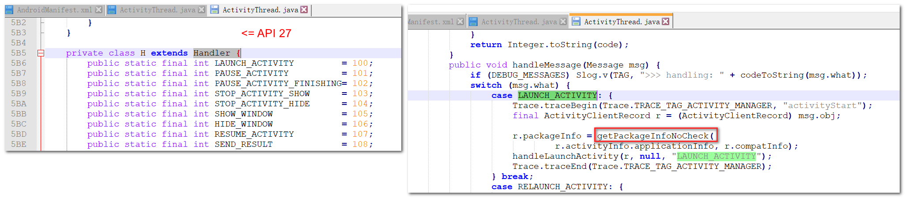
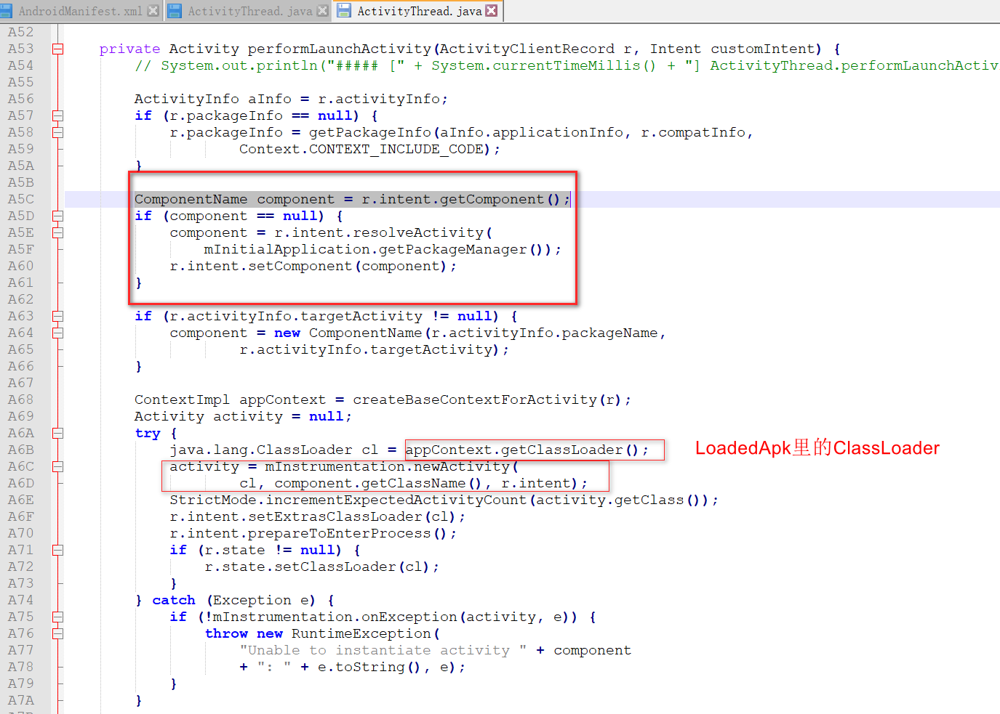
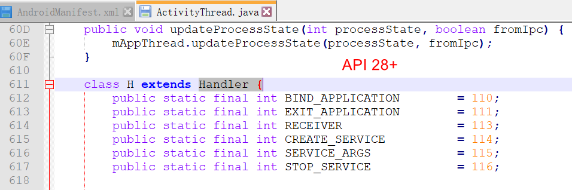

# AndPluginLoadedApkTalk
plugin use LoadedApk and custom ClassLooader

###  插件化方案比较：1. 占位式/插桩式插件化

>
1. （stander标准） 在插件中必须使用 宿主的环境 hostContext
   缺点：不够灵活，需要传递宿主的环境给插件

2. Hook式添加插件DexElement到宿主
   宿主和插件elements 进行融合, 可以在插件中随意使用this，插件可以使用到宿主的环境
   缺点：插件越多 内存中的 newDexElements 就会越大

3. LoadedApk式
   PathClassLoader ---> 宿主的classLoader
   自定义ClassLoader ---> 作为插件的classLoader

###  ActivityThread源码的分析：

startActivity ---> Activity ---> Instrumentation ---> AMS检查
ActivityThread ---> mH LAUNCH_ACTIVITY(自己处理LoaderApk中的ClassLoader)
```java
                case LAUNCH_ACTIVITY: {
                    Trace.traceBegin(Trace.TRACE_TAG_ACTIVITY_MANAGER, "activityStart");
                    // 跳转的Activity纪录
                    final ActivityClientRecord r = (ActivityClientRecord) msg.obj;

                    // 如果缓存mPackages中有LoadedApk 就直接返回，如果没有LoaaedApk就创建出LoadedApk ---》 宿主的LoadedApk.ClassLoader
                    // 如果是加载插件，从mPackages取出 插件专用的LoadedApk.自定义ClassLoader
                    r.packageInfo = getPackageInfoNoCheck( // 宿主的
                            r.activityInfo.applicationInfo, r.compatInfo);

                    // 真正的即将 实例化Activity 然后进行启动
                    handleLaunchActivity(r, null, "LAUNCH_ACTIVITY");
                    Trace.traceEnd(Trace.TRACE_TAG_ACTIVITY_MANAGER);
                } break;

```


**说明：**
1. 缓存中的 final ArrayMap<String, WeakReference<LoadedApk>> mPackages 默认保存的是宿主的LoadedApk


LoadedApk中保存了宿主的LoadedApk.ClassLoader，用来加载宿主中的class，只能加载宿主的class。




以上代码结论：宿主的LoadedApk.ClassLoader 去加载 宿主中的class，然后实例化Activity。

* API28以上的变化，采用AIDL跨进程方式：



### LoadedApk插件化

 **概述：** 自定义一个LoadedApk，自定义一个ClassLoader 用于专门加载插件里面的class，然后实例化。

    1.自定义一个 LoadedApk 然后保存到 mPackages
    2.Packages.value取出 插件专用的LoadedApk.ClassLoader，用来实例化插件Activity
    
    


